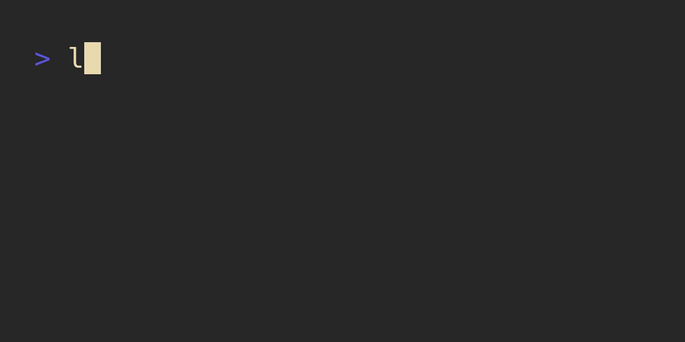

# luatables


Library to render tables nicely to the terminal.

## Examples

### Simple Tables

A simple table can be generated from data:

```lua
local tables = require("luatables")

local headers = {
  "Item",
  "Count",
  "Cost",
}

local data = {
  { "apples",  15, "CHF 30" },
  { "oranges", 2,  "CHF 6" },
  { "bananas", 0 },
  { "total",   17, "CHF 36" },
}

local tbl = tables.Table
    :new()
    :headers(unpack(headers)) -- or table.unpack on newer Lua versions
    :rows(unpack(data))

print(tbl:render())
```

This produces a simple table, without any additional formatting:



### Formatted Tables

Tables can be formatted using a variety of functions provided. The library allows:

- setting borders,
- changing the border styles,
- adding header, row, column separators,
- changing colors
- ...

The formatting is supported via [`luatext`](https://github.com/f4z3r/luatext).

For instance, to print a table having alternating background colors, with the last row having dimmed
foreground:

```lua
local function format_rows(i, _, row)
  if i == 0 then           -- set the header background
    return row:bg(232)     -- uses LuaText formatting
  elseif i % 2 == 0 then   -- alternate row backgrounds for data
    return row:bg(235)
  else
    return row:bg(237)
  end
end

local function format_cells(i, _, cell)
  if i == #data then      -- set foreground of final data row
    return cell:fg(246)
  end
  return cell:fg(255)     -- set other cells foreground
end

local tbl = tables.Table
    :new()
    :headers(unpack(headers))
    :rows(unpack(data))
    :null("n/a")                              -- replace nils
    :header_separator(false)                  -- do not print a separator between header and data
    :border_style(tables.BorderStyle.Double)  -- use double lines in borders and separators
    :format_rows(format_rows)                 -- format rows using the function above
    :format_cells(format_cells)               -- format cells using the function above

print(tbl:render())
```

This produces the following:


## API

The entire API is documented in [the reference document](/docs/reference.md).

## Installation

This module is hosted on LuaRocks, and can be installed using:

```bash
luarocks install luatables
```

## Development

### Roadmap

This is a roadmap of functionality and technical aspects I want to add or improve. I will get to it
when I get to it. Feel free to contribute if you want and have some time.

1. Improve compatibility with Lua 5.1+
2. Cleanup on render functions.
3. Allow to center text (centered justification).
4. Allow headers to be independently justified.
5. Support for column width limitation (text trimming).
6. Support for multiline cells.
