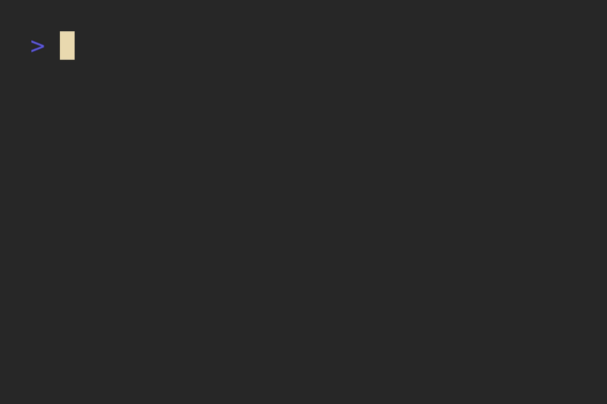

# API Reference

<a name="top"></a>

<!--toc:start-->
- [API Reference](#api-reference)
  - [Example](#example)
  - [Table](#table)
    - [Table:new](#tablenew)
  - [RowType](#rowtype)
  - [FilterCallback](#filtercallback)
  - [JustifyCallback](#justifycallback)
  - [BorderType](#bordertype)
  - [BorderStyle](#borderstyle)
  - [Justify](#justify)
  - [Text](#text)
  - [Color](#color)
<!--toc:end-->

---

## Example

This repository provides a main type, the `Table`. Such tables can be populated with data and then
formatted and styled to your hearts desire.

For instance:

```lua
local string = require("string")
local tables = require("luatables")

local headers = {
  "Item",
  "Count",
  "Cost",
}

local data = {
  { "apples",  15, "CHF 30" },
  { "oranges", 2,  "CHF 6" },
  { "bananas", 0 },
  { "total",   17, "CHF 36" },
}

local function format_cells(i, _, cell)
  if string.find(cell:get_raw_text(), "n/a") then  -- if "n/a", change the text of the cell
                                                   -- string.find is required as the cell text
                                                   -- contains padding spacing
    return cell:dim()      -- uses LuaText formatting,
  end                      -- see https://github.com/f4z3r/luatext/blob/main/docs/reference.md

  if i == #data then       -- format the last row differently
    cell:bold():fg(58)     -- set text to bold and green
  end                      -- this could also be achieved via applying formatting on row level

  return cell              -- otherwise don't add additional formatting
end

local function format_rows(i, _, row)
  if i == 0 then          -- index 0 is the header row
    return row:fg(tables.Color.Red)  -- format header row with red text
  end
  return row              -- otherwise don't add additional formatting
end

local function format_seps(sep)
  return sep:fg(tables.Color.Cyan)   -- format separators (and borders) in cyan
end

local tbl = tables.Table
    :new()                      -- create new table
    :headers(unpack(headers))   -- set headers
    :rows(unpack(data))         -- _add_ data
    :null("n/a")                -- replace nil values
    :border()                   -- set full borders
    :border_style(tables.BorderStyle.Double)  -- set border style
    :header_separator()         -- create a separator between headers and data
    :format_rows(format_rows)   -- format rows
    :format_separators(format_seps)  -- format separators (precedence over rows)
    :format_cells(format_cells) -- format rows (precedence over rows)

print(tbl:render())             -- render and print the table
```

This generates the table as follows:



[Back to the top](#top)

## Table

### Table:new

```lua
(method) Text:new(str?: string|Text)
  -> Text
```

Create a new `Text` from a string.

Parameters:
- `str` — The text to be displayed in this `Text`.


[Back to the top](#top)

## RowType

An raw enumeration, can be either `"data"` or `"separator"`. Represents the type of row being
rendered. Data rows are rows that contain standard cells. Separator rows are rows containing
exclusively separator symbols. These rows are only rendered when using `row_separator()`.

[Back to the top](#top)

## FilterCallback

A type alias for:

```lua
fun(idx: number): boolean
```

[Back to the top](#top)

## JustifyCallback

A type alias for:

```lua
fun(idx: number): Justify
```

> See the [`Justify`](#justify) type.

[Back to the top](#top)

## BorderType

```lua
table
```

An enum for the border type of the table. Can be any of:

- `None`: do not add borders around the table (default when creating tables).
- `TopBottom`: only apply borders above and below the table.
- `Sides`: only apply borders on the sides (left and right) of the table.
- `All`: apply borders everywhere (identical to `BorderType.TopBottom + BorderType.Sides`).

[Back to the top](#top)

## BorderStyle

```lua
table
```

An enum for the border style. Can be any of:

- `Single` (default when creating tables)
- `Double`
- `Fat`

[Back to the top](#top)

## Justify

```lua
table
```

An enum expressing text justification. Can be:

- `Left` (default for all columns when creating tables).
- `Right`

> `Center` is currently not supported but on the roadmap.

[Back to the top](#top)

## Text

This is a re-export of [`luatext.Text`](https://github.com/f4z3r/luatext/blob/main/docs/reference.md#text).

[Back to the top](#top)

## Color

This is a re-export of [`luatext.Color`](https://github.com/f4z3r/luatext/blob/main/docs/reference.md#color).

[Back to the top](#top)
